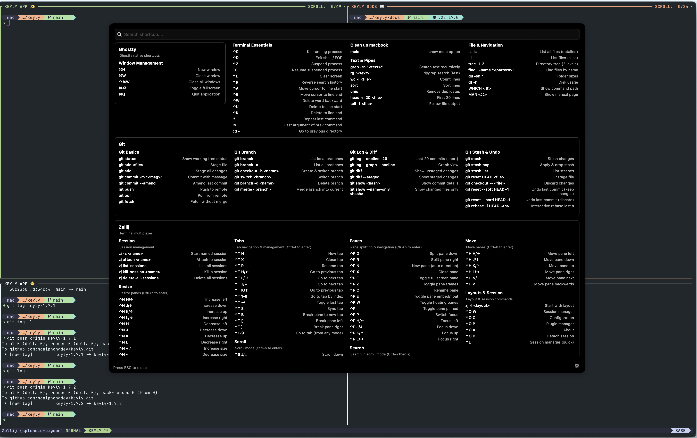

# Keyly

macOS menu bar app that displays keyboard shortcuts for the currently active application when you hold the ⌘ (Command) key.

> **Inspiration**: This project is inspired by [CheatSheet](https://www.mediaatelier.com/CheatSheet). Keyly is a complete reimplementation in Swift with additional features like custom shortcut configs and settings menu.

## 🚀 Installation

> **1.** Open any terminal app on your Mac (Terminal, iTerm, Warp, etc.)
>
> **2.** Paste this command and press Enter:

```bash
curl -fsSL https://raw.githubusercontent.com/hoaiphongdev/keyly/main/scripts/install.sh | bash
```

> **3.** Follow the on-screen instructions to grant Accessibility permission
>
> **4.** Done! Hold `⌘ Command` for 2 seconds to show shortcuts

## Screenshots

<p align="center">
  
  <br><br>
  
</p>

## Features

- Hold ⌘ for 2 seconds to show shortcuts
- Extracts real shortcuts from app menu bar via Accessibility API
- Works with any macOS application
- Multi-column layout with category grouping
- Floating window with blur effect
- Custom shortcut configs via `.keyly` files
- Settings menu (Reload, Open Config, Accessibility Settings, Check for Updates, Quit)
- Automatic updates via Sparkle

## Requirements

- macOS 12.0+
- Swift 5.9+
- Accessibility permissions

## Permissions

The app requires Accessibility permissions to:
1. Monitor global keyboard events
2. Read menu bar shortcuts from other applications

On first launch, go to **System Settings → Privacy & Security → Accessibility** and enable **Keyly**.

## Usage

1. Run the app - you'll see a ⌘ icon in the menu bar
2. Open any application
3. Hold the **Command (⌘)** key for 2 seconds
4. A window will appear showing all keyboard shortcuts
5. Release ⌘ to hide the window

## Custom Shortcuts

Create `.keyly` files in `~/.config/keyly/` to add custom shortcuts:

```
# Sheet Name: My Shortcuts
# App: /Applications/Safari.app

[Navigation]
CMD+L       Open Location
CMD+T       New Tab
CMD+SHIFT+T Reopen Last Tab

[Bookmarks]
CMD+D       Add Bookmark
```

## Community Templates

Install pre-made shortcut templates from the community:

Install a template:

```bash
curl -sL https://raw.githubusercontent.com/hoaiphongdev/keyly/main/scripts/install-templates.sh | bash -s -- -t cursor.keyly
```

Install with custom name:

```bash
curl -sL https://raw.githubusercontent.com/hoaiphongdev/keyly/main/scripts/install-templates.sh | bash -s -- -t cursor.keyly -n my-cursor.keyly
```

**Options:**
- `-t <name>` - Template name (required)
- `-n <name>` - Save as custom filename (optional)

**Available templates:** [templates/](https://github.com/hoaiphongdev/keyly/tree/main/templates)

## Auto-Update

Keyly uses [Sparkle](https://sparkle-project.org/) for automatic updates. Updates are checked daily and can also be triggered manually via:
- Menu bar icon → Check for Updates...
- Settings button → Check for Updates...

### For Developers: Release Process

1. **Generate EdDSA keys** (one-time setup):
   ```bash
   swift build  # Fetch Sparkle
   ./scripts/generate-keys.sh
   # Save the public key to sparkle_eddsa_public_key.txt
   ```

2. **Build release**:
   ```bash
   just release 1.0.0
   ```

3. **Sign the DMG**:
   ```bash
   ./scripts/sign-update.sh .build/Keyly.dmg
   ```

4. **Update appcast.xml** with the signature and upload to GitHub Pages

5. **Create GitHub Release** and upload `Keyly.dmg`

## License

Licensed under the [Apache License, Version 2.0](LICENSE).

---

Made with ❤️ by [hoaiphongdev](https://github.com/hoaiphongdev)
